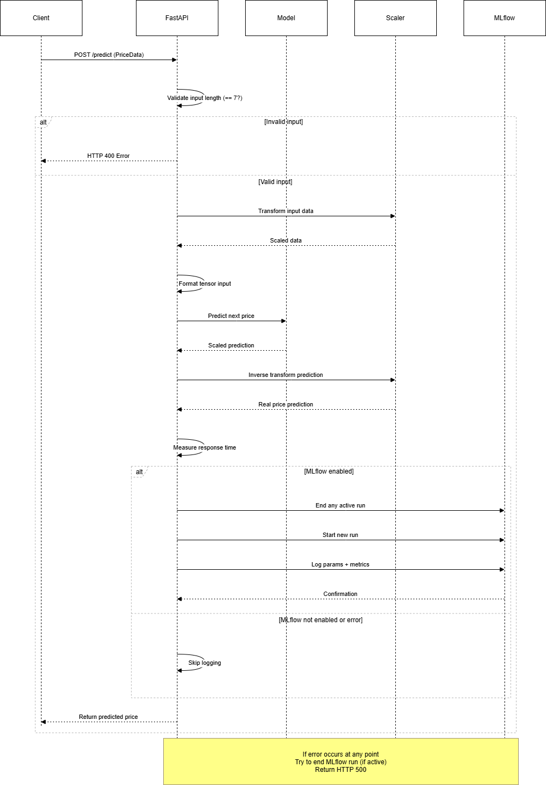
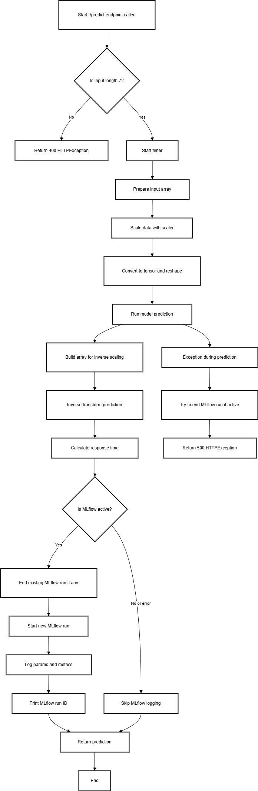

# Preditor de Preços de Ações da Apple com LSTM

Este projeto implementa um modelo LSTM (Long Short-Term Memory) para prever preços de ações com base em dados históricos. Ele inclui um  Jupyter notebook para treinamento e avaliação do modelo, além de uma API desenvolvida com FastAPI para servir o modelo em produção e realizar previsões. A monitoração e o rastreamento do modelo são feitos com MLflow com dados visualizados no Databricks.


## Tecnologias Utilizadas

- **Linguagem**: Python  
- **Framework de Deep Learning**: PyTorch  
- **Framework da API**: FastAPI  
- **Fonte dos Dados**: [yfinance](https://github.com/ranaroussi/yfinance)  
- **Monitoramento de Modelo**: MLflow 
- **Visualização do Monitoramento**: Databricks 
- **Outras Ferramentas**: Scikit-learn, Uvicorn, PyProject (gerenciamento de dependências via UV)


## Instalação

Este projeto utiliza o [UV](https://github.com/astral-sh/uv) para gerenciamento de dependências. Certifique-se de ter o `uv` instalado:

```bash
pip install uv

git clone https://github.com/adamsdossantos/lstm.git
cd repo
uv venv
uv pip install -r uv.lock
```

## Como Usar

Você pode explorar, treinar e avaliar o modelo LSTM usando o Jupyter notebook localizado na raiz do projeto

## Executando a API

Use o uvicorn para rodar a aplicação FastAPI:

```bash
uvicorn project_api.main:app --reload
```
A API estará disponível em: http://127.0.0.1:8000

A documentação interativa estará disponível em:
http://127.0.0.1:8000/docs

## Configuração

Todas as dependências estão listadas no arquivo pyproject.toml e bloqueadas no uv.lock. Não é necessário configurar variáveis de ambiente ou arquivos adicionais.

## Estrutura do Projeto

```bash
├── stock_prediction.ipynb      # Treinamento e avaliação do modelo
├── pyproject.toml                   # Lista de dependências
├── uv.lock                          # Versões bloqueadas das dependências
└── project_api/
    ├── __init__.py
    ├── main.py                      # Ponto de entrada da aplicação FastAPI
    ├── modelos.py                   # Definição do modelo LSTM
    ├── route/
    │   └── aplicativo.py            # Rotas da API
    └── utils/
        ├── model.pth                # Modelo LSTM treinado
        ├── scaler.pkl               # Scaler para normalização dos dados de entrada
        └── activate_mlflow.py       # Integração com MLflow
```
## Arquitetura da API



## Fluxograma do API



## Contribuições

Este projeto não aceita contribuições.

## Licença

Este projeto está licenciado sob a Licença MIT.


